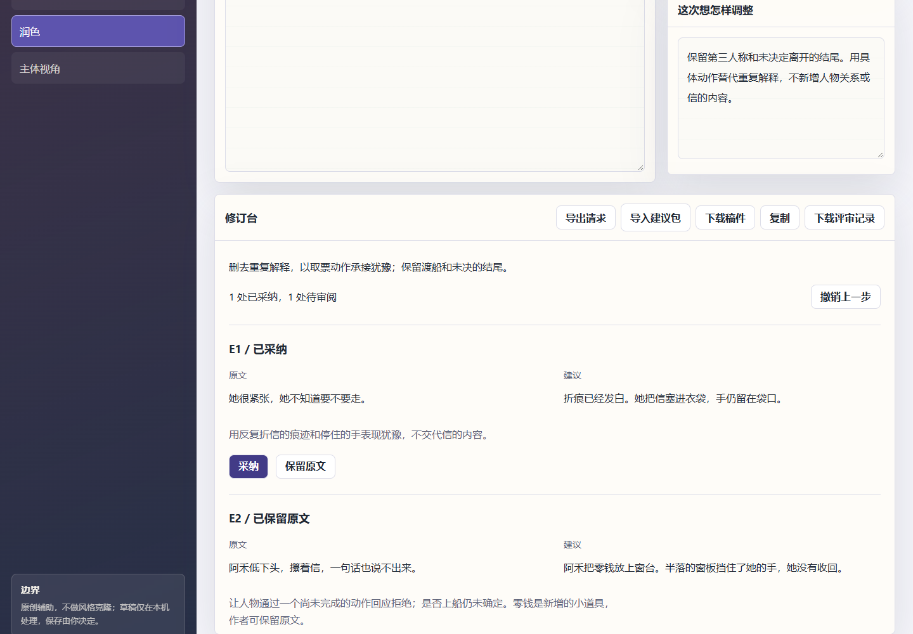

# Literary Writing Studio

帮助小说作者尝试修改，同时保留自己的表达和原稿。宿主 AI 提出大纲、灵感和局部修订，本地插件校验原文定位，作者在修订台逐条采纳、保留或撤销，导出自己确认的稿件。

## 三分钟体验

需要 Python 3.10+。不需要数据库或模型密钥。

```bash
python -m pip install -r requirements.txt
python scripts/serve_app.py --port 8765
```

打开终端显示的本机网址，点击 **试读修订**。采纳 E1、保留 E2，再撤销一步。**下载稿件**只包含当前选择后的正文，原稿不被覆盖。**保存**明确写入本机浏览器，关闭前也可导出作品包；浏览器存储不是云备份。



## 用自己的材料

1. 选择大纲、灵感、润色或主体视角，填写相应材料及“这次想怎样调整”。
2. 点击 **准备写作请求**，再 **导出请求**。把 JSON 交给已安装此插件的 AI 助手，要求按内附契约生成建议包。
3. 用 **导入建议包**载入 JSON。修订任务逐条采纳或保留原文；大纲和灵感直接审阅完整提案及新增设定。
4. 下载稿件或评审记录。原稿、任务或要求改变后，旧建议停止应用，需要重新准备。

本地网页不调用 LLM。没有 AI 宿主时，可以体验附带案例、管理稿件与审阅人工编写的建议包，但不会声称自动完成文学创作。插件宿主承担创造与语义判断，Python 承担可确定的定位与选择。项目不是通用 AI 写作模型。

## 可运行插件

插件入口：[.codex-plugin/plugin.json](.codex-plugin/plugin.json)，技能：[SKILL.md](skills/literary-writing-agent/SKILL.md)。输入输出是版本化 JSON，代码拒绝过期输入、找不到的原文、错误出现次数、重叠修改和未知采纳编号。

```bash
python scripts/plugin_run.py --input examples/revision-input.json --proposal examples/revision-proposal.json --output-dir output/first-review
```

默认不采纳任何修改，输出 manuscript.txt 与原稿完全一致。作者明确选择后，在输入 JSON 中增加 `"accepted_edits": ["E1"]`，用新的输出目录重跑即可。详见 [插件协议](docs/plugin.md)。

## 四类原创案例

| 任务 | 输入 | 提案 | 实际评审结果 |
|---|---|---|---|
| 场景修订 | [末班渡船](examples/revision-input.json) | [逐条建议](examples/revision-proposal.json) | [未采纳版本](examples/revision-review.md) |
| 主体视角 | [修船棚](examples/agency-input.json) | [视角建议](examples/agency-proposal.json) | [理由与原稿](examples/agency-review.md) |
| 大纲 | [失物清单](examples/outline-input.json) | [场景方案](examples/outline-proposal.json) | [完整大纲](examples/outline-review.md) |
| 灵感 | [渡口售票员](examples/inspiration-input.json) | [两种方向](examples/inspiration-proposal.json) | [取舍与新增设定](examples/inspiration-review.md) |

这些是明确标注的虚构提案，不是按关键词挑选的固定输出。旧版四个 CLI 保留，现只准备写作请求，不再返回与输入无关的样例故事。[旧命令](docs/safe-demo.md)

## 产品与证据

[用户问题和产品取舍](docs/product-case.md) | [工作流](docs/workflow.md) | [技术验收](docs/validation.md) | [独立技能试跑](docs/evaluation/skill-forward-test.md) | [开源选择](docs/open-source.md) | [维护记录](CHANGELOG.md)

```bash
python -m unittest discover -s tests -v
python scripts/build_review_examples.py --check
npm ci
npx playwright install chromium
npm run test:review
powershell -ExecutionPolicy Bypass -File scripts/portfolio_audit.ps1
```

所有公开示例原创虚构，不包含私人稿件。精确定位不等于文学质量或语义忠实；原创性与风格边界需要宿主和作者审阅。没有作者满意度或效率提升的实测结论。
